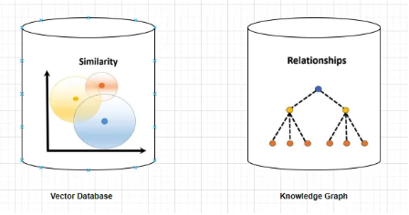

# Multi-hop RAG with Cortex Search

This tutorial guides you through building a multi-hop RAG for complex PDFs. It combines hybrid search for document retrieval with document graph traversal. The system performs two-step retrieval: first finding semantically similar documents through vector search, then traversing connected documents via extracted cross-references.

## Usage
- Upload the [preprocessing notebook](multihop_rag_preprocess.ipynb) to Snowflake using the [instructions here](https://docs.snowflake.com/en/user-guide/ui-snowsight/notebooks-create#create-a-new-notebook)
- Download [sample processed documents](https://drive.google.com/drive/folders/1OKfqpAts2cXkDZ3ZwosagTJvH3cBcmbu?usp=sharing) and upload to your Snowflake stage, or use your own documents processed through the multimodal RAG pipeline
- Follow the notebook instructions to:
  - Extract text and create multimodal vector embeddings
  - Build a multimodal Cortex Search service
  - Analyze documents for cross-references using Snowflake AISQL
  - Create a knowledge graph of document connections
  - Implement recursive SQL functions for multihop traversal
- Deploy the [Streamlit app](streamlit_chatbot_multihop_rag.py) for interactive multi-hop multimodal RAG queries that leverage both vector search and document graph traversal for augmented context retrieval

## Key Features
- **Hybrid & Multimodal Vector Search**: Uses Cortex Search for keyword and semantic search across text and images
- **AI-Powered Reference Extraction**: Uses Snowflake AI SQL to identify and extract document relationships
- **Document Graph Traversal**: Follows cross-references between connected documents/pages for context augmentation before LLM response generation
